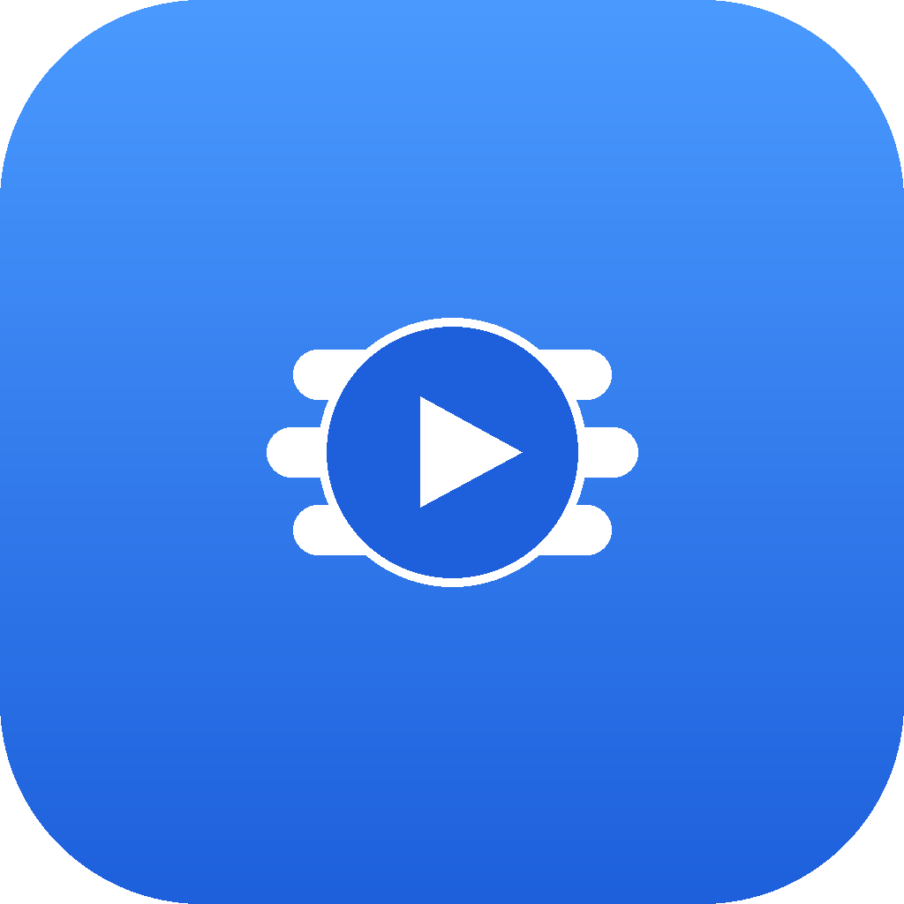
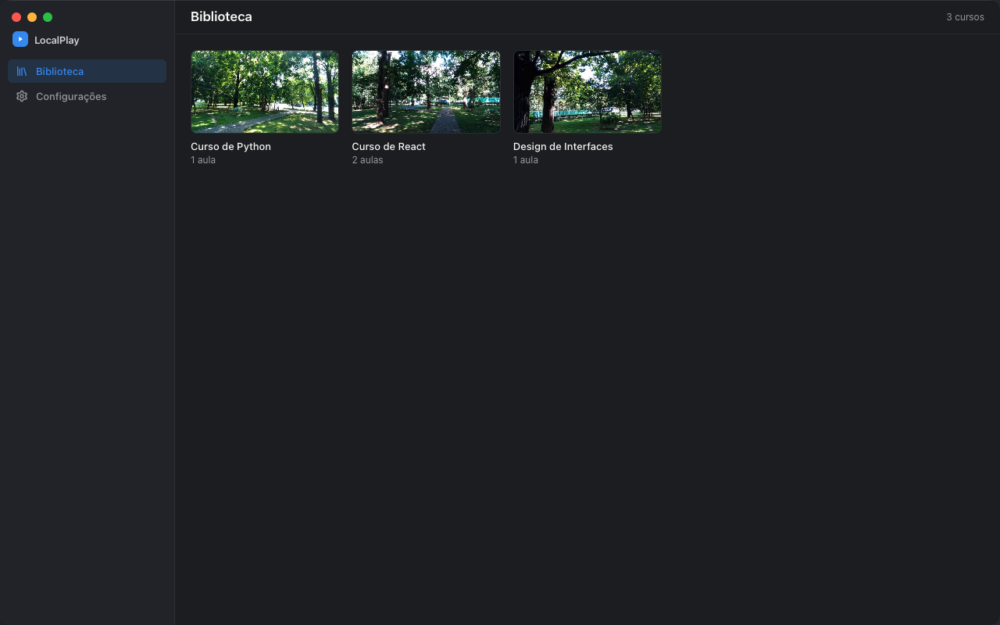
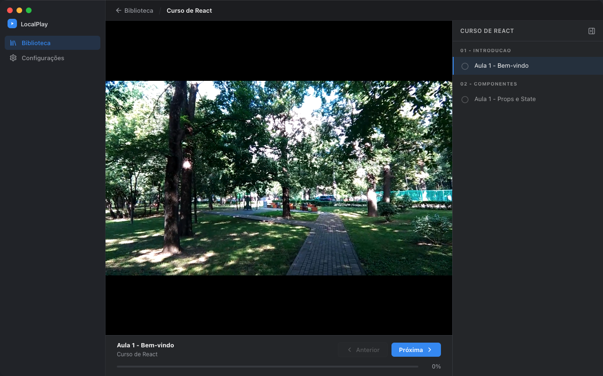

# LocalPlay

[](https://github.com/rodrigueskaua/localplay-desktop/releases/latest)
[](https://github.com/rodrigueskaua/localplay-desktop/releases/latest)
[](LICENSE)

**Player desktop para cursos, treinamentos e conteúdos em vídeo.**

O LocalPlay transforma **qualquer pasta de vídeos em uma experiência semelhante a uma plataforma de cursos**, com biblioteca, aulas, progresso na aula e conclusão.

Basta selecionar uma pasta e começar a assistir. **Tudo fica salvo localmente no seu Mac**, sem upload, servidor ou internet.

## Features

- Seleção de uma ou mais pastas de vídeos
- Biblioteca organizada como uma plataforma de cursos
- Capas geradas automaticamente
- Progresso por aula
- Retomada de onde parou
- Marcação de aulas concluídas
- Avanço automático para a próxima aula
<div align="center">
  
  
</div>

## Download

Acesse a [página de releases](https://github.com/rodrigueskaua/localplay-desktop/releases/latest) e baixe o `LocalPlay-<versão>-arm64.dmg`.

1. Abra o `.dmg` e arraste o LocalPlay para a pasta Aplicativos
2. Na primeira abertura, clique com o botão direito no app e escolha "Abrir" (o app ainda não é assinado pela Apple)

Compatível com Macs Apple Silicon (M1/M2/M3/M4).

## Features

- Seleção de pasta de vídeos via diálogo nativo, com suporte a múltiplas pastas simultâneas
- Biblioteca unificada com capas geradas automaticamente a partir dos próprios vídeos
- Progresso por aula (retomar, marcar como concluído, avanço automático)
- Interface nativa de app Mac
- 100% offline, nenhum dado sai da máquina

## Stack

<a href="https://www.electronjs.org/" target="_blank">
  
</a>
<a href="https://nuxt.com/" target="_blank">
  
</a>
<a href="https://vuejs.org/" target="_blank">
  
</a>
<a href="https://www.fastify.io/" target="_blank">
  
</a>
<a href="https://tailwindcss.com/" target="_blank">
  
</a>
<a href="https://www.sqlite.org/" target="_blank">
  
</a>
<a href="https://orm.drizzle.team/" target="_blank">
  
</a>

### Bibliotecas complementares

[better-sqlite3](https://github.com/WiseLibs/better-sqlite3) <br>
[electron-builder](https://www.electron.build/) <br>
[Plyr](https://plyr.io/) <br>
[Lucide Icons](https://lucide.dev/) <br>
[VueUse](https://vueuse.org/) <br>

## Desenvolvimento

### Pré-requisitos

- Node.js >= 20
- npm >= 10

### Instalação

```sh
git clone https://github.com/rodrigueskaua/localplay-desktop.git
cd localplay-desktop
npm run install:all
```

### Rodar em modo desenvolvimento

```sh
npm run dev
```

### Gerar o instalador (.dmg) para Mac

```sh
cd frontend && npm run generate
cd ../electron && npm run dist:mac
```

O instalador é gerado em `electron/dist/`.
